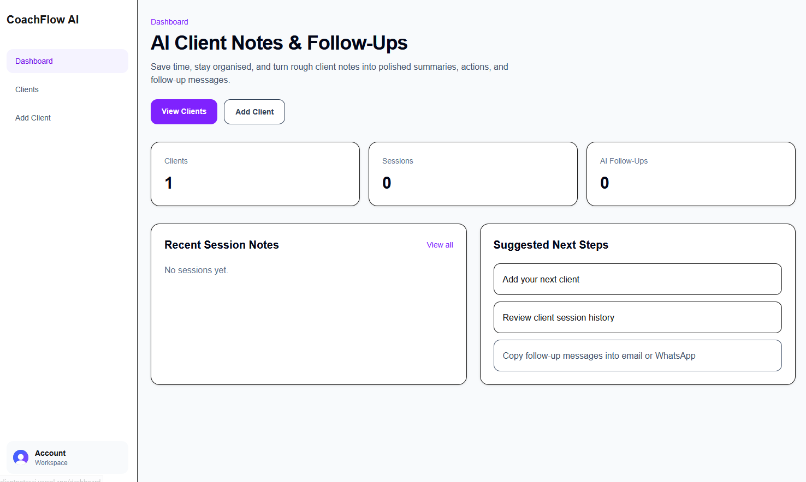

# 🤖 AI Client Notes

A full-stack web application built with **Next.js, TypeScript and Prisma**, designed as a client-notes and AI-focused application.

The project demonstrates my experience working with a modern TypeScript application, structured frontend and backend code, reusable UI components, database tooling and deployment configuration.

---

## 🚀 Project Overview

AI Client Notes is a web application developed to explore building a modern application around client information, notes and AI-assisted functionality.

The project is structured as a full-stack application and includes separate areas for:

* Frontend functionality
* Backend functionality
* Reusable UI components
* Database configuration
* Public assets
* Project documentation
* Screenshots

---

## 🛠️ Tech Stack

**Frontend**

* Next.js
* TypeScript
* React
* Tailwind CSS
* Reusable UI components

**Backend**

* Next.js
* TypeScript
* Backend/API functionality

**Database**

* Prisma
* Database schema/configuration

**Development Tools**

* ESLint
* Git
* GitHub

**Deployment**

* Railway configuration
* Next.js production configuration

---

## 🏗️ Project Structure

The project is organised into separate areas for different responsibilities.

```text
AIClientNotes/
│
├── aiClientnotes/
│   ├── backend/
│   ├── components/
│   ├── frontend/
│   ├── prisma/
│   ├── public/
│   ├── RepoScreenshots/
│   └── src/
│
├── components/
│   └── ui/
│       ├── button.tsx
│       ├── card.tsx
│       ├── input.tsx
│       └── textarea.tsx
│
├── docs/
├── prisma/
├── public/
├── src/
│
├── next.config.ts
├── prisma.config.ts
├── railway.json
├── package.json
└── tsconfig.json
```

The project also includes reusable UI components such as buttons, cards, inputs and textareas.

---

## 🧩 Reusable Components

The project uses reusable React/TypeScript UI components to help keep the interface consistent and maintainable.

Current components include:

```text
components/ui/
├── button.tsx
├── card.tsx
├── input.tsx
└── textarea.tsx
```

This demonstrates experience with component-based development and creating reusable interface elements rather than building every element independently.

---

## 🗄️ Database

The project uses **Prisma** for database tooling and configuration.

The repository contains:

```text
prisma/
prisma.config.ts
```

This provides experience working with database schemas and integrating database functionality into a modern TypeScript application.

---

## 📸 Screenshots

### Application



### Client Notes


### AI Features


> Screenshots demonstrate the application's interface and key areas of functionality.

---

## 🔧 Development

During development, I worked with:

* Next.js application structure
* TypeScript
* React components
* Reusable UI components
* Prisma configuration
* Frontend/backend separation
* Environment configuration
* ESLint
* Deployment configuration

The project has also involved troubleshooting issues across the application structure and development environment.

---

## 🌍 Deployment

The repository includes deployment configuration for **Railway** and production configuration for Next.js.

The project has been developed with consideration for both local development and deployment environments.

---

## 📚 What This Project Demonstrates

This project demonstrates my ability to:

* Build applications using Next.js
* Work with TypeScript
* Create reusable React components
* Structure a full-stack application
* Work with Prisma and database tooling
* Organise frontend and backend functionality
* Work with environment configuration
* Use Git and GitHub
* Configure applications for deployment

---

## 🎯 Project Status

**Portfolio project — active development**

AI Client Notes is part of my full-stack development portfolio and demonstrates my progression into building modern TypeScript-based applications using Next.js and database technologies.

---

## 👩‍💻 About Me

I'm a self-taught full-stack web developer with a background in project management and telecommunications.

I'm focused on developing professional skills across **React, TypeScript, Next.js, Node.js, APIs, databases and cloud technologies**.

My portfolio projects are designed to demonstrate not only the technologies I can use, but also my ability to structure applications, solve development problems and take projects from an initial idea through to a working application.

---

## 🔗 Links

**Live Demo:** https://clientnotesai.vercel.app/sign-in

**GitHub:** https://github.com/SusanAlexFSD/AIClientNotes
